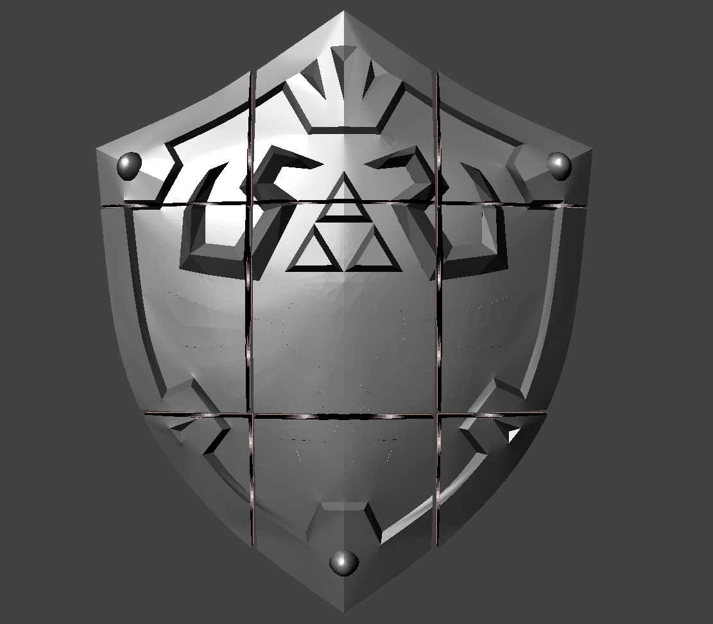

# Hylian Shield Split for Ender 3 (220x220x250)

This folder contains the [Hylian Shield](../Hylian-Shield-BOTW.stl) sliced to fit on an Ender 3 bed size (220mm x 220mm x 250mm)

The common parts for the cut-out sections can be found [here](../Comman\ Parts)

# Print Settings
**Resolution** - 3 walls  
**0.28** for the Shield body  
**0.2** for everything else  

**Infill** - Gyroid   
**2.5%** for the Shield body  
**5%** for everything else

**Supports** - Tree

**Filament** ~ 2.5kg

**Time** - 6~8 Days

