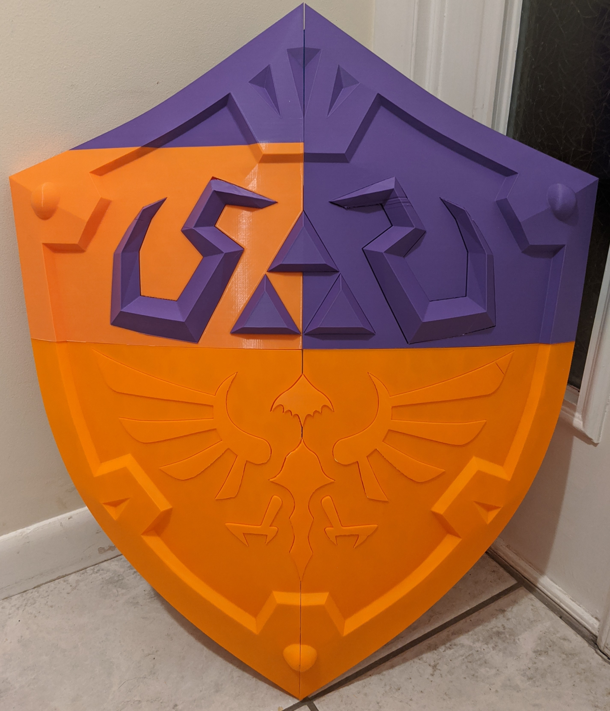

# Hylian Shield Split for Ender 5 Plus (350x350x400)

This folder contains the [Hylian Shield](../Hylian-Shield-BOTW.stl) sliced to fit on an Ender 5 plus bed size (350mm x 350mm x 400mm)

All files with the name **-Arranged* are rotated and arranged in the way I printed them. The other files are there if you'd like to lay them out on your own.

# Print Settings
**Resolution** - 3 walls  
**0.28** for the Shield body  
**0.2** for everything else  

**Infill** - Gyroid   
**2.5%** for the Shield body  
**5%** for everything else

**Filament** ~ 2.5kg

**Time** ~ 3 Days

